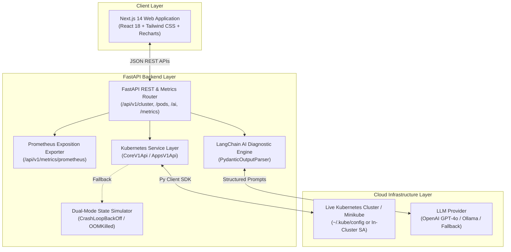
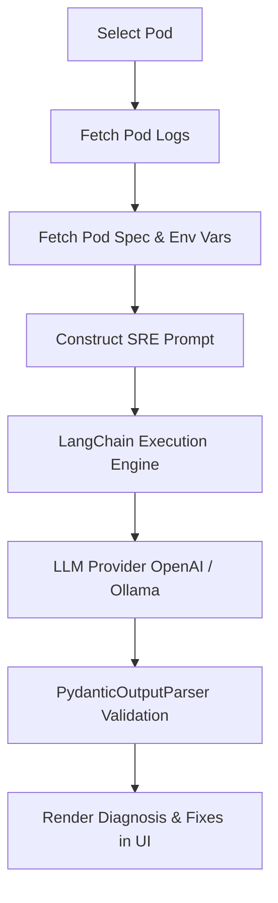

# 🚀 KubePilot
### **AI-Powered Kubernetes Operations Copilot**


A cloud-native operations platform engineered to reduce **Mean Time to Resolution (MTTR)** by combining real-time cluster telemetry with automated LLM root-cause diagnosis.

---

## ❓ Why KubePilot?

Diagnosing Kubernetes failures typically requires engineers to inspect logs, pod specifications, events, metrics, and deployment history across multiple disparate tools.

**KubePilot** centralizes these workflows into a single AI-assisted platform that correlates Kubernetes telemetry with LLM-powered root cause analysis, allowing engineers to diagnose and remediate incidents from a single interface.

---

## ✨ Feature Overview

| Feature | Description |
| :--- | :--- |
| **AI SRE Diagnostics** | One-click LangChain log analysis delivering root cause, severity rating, and step-by-step remediation steps. |
| **"What Changed Today?"** | AI-generated timeline summaries of recent deployments, scaling events, pod crashes, and deleted resources. |
| **Cluster Telemetry** | Real-time status counters, node readiness, and active warning alert notifications. |
| **Metrics & Prometheus** | Live CPU Core and RAM memory charts + native `/api/v1/metrics/prometheus` exposition endpoint for scrapers. |
| **Kubernetes Explorer** | Browse Namespaces, Pods, Deployments, ReplicaSets, Services, and Nodes with real-time status pills and filters. |
| **Interactive Log Viewer** | Stream container stdout/stderr logs with error level syntax highlighting (`[ERROR]`, `[WARN]`, `[INFO]`), search filtering, and copy features. |
| **Production Health Probes** | Pre-configured `livenessProbe` and `readinessProbe` configs for zero-downtime Kubernetes deployments. |

---

## 🏗️ Architecture & Data Flow



---

## 🤖 AI Diagnostic Workflow Pipeline

The execution flow when an engineer triggers **"Troubleshoot with AI"**:



---

## 📂 Project Structure

```
kubepilot/
├── **backend/**
│   ├── **app/**
│   │   ├── **api/v1/endpoints/**  # REST & Prometheus route handlers
│   │   ├── **core/**               # App configuration & logging
│   │   ├── **schemas/**            # Pydantic v2 validation models
│   │   ├── **services/**
│   │   │   ├── **ai/**             # LangChain AI diagnostic engine
│   │   │   └── **kubernetes/**     # K8s Python SDK client & state simulator
│   │   └── **utils/**              # Prometheus metrics exporter
│   ├── **tests/**                  # Pytest automated test suite
│   ├── Dockerfile
│   └── requirements.txt
├── **frontend/**
│   ├── **src/**
│   │   ├── **app/**                # Next.js App Router pages
│   │   ├── **components/**         # Dashboard, Explorer, Log Viewer, AI Modal
│   │   └── **services/**           # Axios API client
│   ├── Dockerfile
│   └── package.json
├── **k8s/**                        # Kubernetes deployment manifests with probes
├── **.github/workflows/**          # GitHub Actions CI pipeline
└── docker-compose.yml              # Unified local container orchestration
```

---

## 📚 REST API Reference

- **Authentication**: `None (Development)` | `OAuth2 / JWT (Planned)`

### Sample Endpoint: `GET /api/v1/pods`

```bash
curl -X GET "http://localhost:8000/api/v1/pods?namespace=production&status=CrashLoopBackOff"
```

```json
[
  {
    "name": "payment-service-75b897858-a912b",
    "namespace": "production",
    "status": "CrashLoopBackOff",
    "ip": "10.244.1.15",
    "node": "minikube-node-02",
    "creation_timestamp": "2026-08-06T18:22:10Z",
    "restart_count": 8,
    "cpu_usage_m": 450,
    "memory_usage_mb": 512,
    "containers": [
      {
        "name": "payment-app",
        "image": "ghcr.io/company/payment-service:v2.4.1",
        "ready": false,
        "restart_count": 8,
        "state": "waiting (CrashLoopBackOff)"
      }
    ]
  }
]
```

### Endpoint Directory

| Endpoint | Method | Description |
| :--- | :--- | :--- |
| `/api/v1/cluster/health` | `GET` | Retrieve aggregate cluster health summary & metrics |
| `/api/v1/namespaces` | `GET` | List all Kubernetes namespaces |
| `/api/v1/pods` | `GET` | List & filter pods by namespace and status |
| `/api/v1/pods/{ns}/{name}` | `GET` | Retrieve detailed pod specs, env vars, and events |
| `/api/v1/logs/{pod_name}` | `GET` | Stream container stdout/stderr log output |
| `/api/v1/deployments` | `GET` | List deployments and ready replica counts |
| `/api/v1/services` | `GET` | List services, types, and ClusterIPs |
| `/api/v1/nodes` | `GET` | List node specs and resource utilization |
| `/api/v1/metrics` | `GET` | Retrieve time-series CPU and Memory JSON metrics |
| `/api/v1/metrics/prometheus` | `GET` | Expose **Prometheus exposition metrics** for scrapers |
| `/api/v1/ai/analyze` | `POST` | Trigger LangChain AI log analysis on a pod |
| `/api/v1/ai/summary` | `POST` | Generate AI change summary ("What changed today?") |
| `/api/v1/notifications` | `GET` | Fetch active cluster warning alerts |

---

## ⚡ Observed Local Performance

*Observed during local development execution (Minikube / Docker environment):*

| Metric | Observed Value |
| :--- | :--- |
| **FastAPI Backend Cold Startup** | `~1.2 seconds` |
| **REST API Endpoint Latency** | `< 45 ms` |
| **AI Diagnosis Pipeline Execution** | `~2.1 seconds` |
| **Prometheus Exporter Response** | `< 12 ms` |

---

## 🎯 System Design Decisions

- **Why FastAPI?** Chosen for high-performance asynchronous execution (`async`/`await`), automatic OpenAPI/Swagger documentation, and native Pydantic v2 data validation.
- **Why Kubernetes Python SDK?** Uses official client models (`CoreV1Api`, `AppsV1Api`) for typed, secure API calls without relying on shell commands.
- **Why LangChain?** Facilitates structured prompt templates and output parsing (`PydanticOutputParser`), ensuring structured JSON outputs validated using Pydantic.
- **Why Docker & Docker Compose?** Guarantees environment parity between local development and production container deployments.

---

## 🛠️ Engineering Challenges

- **Dual-Mode Cluster Operations**: Supporting both live Kubernetes clusters and a local simulator seamlessly without code modifications.
- **Deterministic AI Responses**: Designing structured prompt constraints to parse inconsistent container log tracebacks into uniform diagnostic schemas.
- **API Resilience**: Gracefully catching Kubernetes client connection failures and missing API key exceptions to prevent service disruption.
- **UI Responsiveness**: Managing asynchronous API polling for logs while keeping the Next.js frontend fluid.

---

## 🎓 Key Learnings

- Designing RESTful APIs for cloud-native applications using FastAPI and Pydantic v2.
- Integrating Kubernetes cluster APIs through the official Python SDK.
- Orchestrating AI-assisted operational workflows with LangChain.
- Containerizing multi-service architectures using Docker and Kubernetes.
- Implementing CI/CD automation pipelines with GitHub Actions.

---

## 🛡️ Error Handling & Reliability

- **Kubernetes Disconnection**: Automatically switches to the fallback diagnostic engine if `~/.kube/config` is missing or unreachable.
- **Missing AI API Key**: Executes a fallback diagnostic engine to ensure continuous operation during offline testing.
- **Pod Deletion During Analysis**: Returns a graceful HTTP 404 response with human-readable error messaging.

---

## 🚀 Getting Started

### Option 1: Single-Command Setup with Docker Compose

```bash
# Clone the repository
git clone https://github.com/harsharaju1314-hash/kubepilot.git
cd kubepilot

# Build and launch unified container stack
docker-compose up --build
```

Access the services:
- 🌐 **Web UI**: [http://localhost:3000](http://localhost:3000)
- 📚 **FastAPI Interactive Docs**: [http://localhost:8000/docs](http://localhost:8000/docs)
- 📊 **Prometheus Metrics Stream**: [http://localhost:8000/api/v1/metrics/prometheus](http://localhost:8000/api/v1/metrics/prometheus)

---

### Option 2: Local Development Setup

#### 1. Backend Setup (FastAPI)

```bash
cd backend

# Create virtual environment
python -m venv venv
source venv/bin/activate  # On Windows: venv\Scripts\activate

# Install dependencies
pip install -r requirements.txt

# Run pytest unit tests (covers API endpoints & AI diagnostic pipeline)
pytest -v

# Start FastAPI server
python -m uvicorn app.main:app --reload --port 8000
```

#### 2. Frontend Setup (Next.js)

```bash
cd frontend

# Install node dependencies
npm install

# Start Next.js dev server
npm run dev
```

---

## 🗺️ Roadmap & Future Enhancements

- 🌐 **Multi-Cluster Support**: Manage multiple Kubernetes contexts from a single dashboard.
- 🔐 **OAuth2 & JWT Authentication**: Role-based access control (RBAC) for cluster actions.
- 🔔 **Slack & PagerDuty Alerts**: Webhook dispatching for critical pod incidents.
- 📊 **Grafana Dashboard Templates**: Pre-configured dashboards for cluster metrics.

---

## 📜 License

This project is licensed under the MIT License - see the [LICENSE](LICENSE) file for details.
