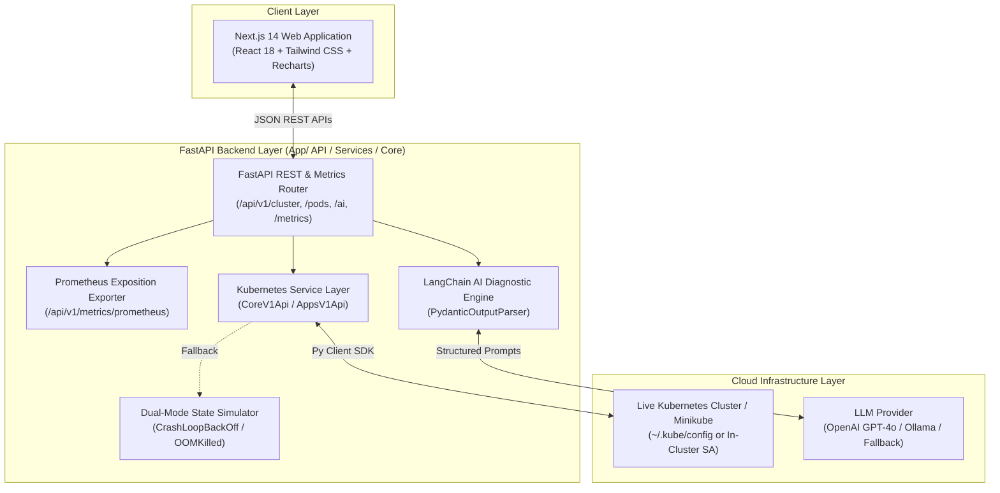

# 🚀 KubePilot: AI-Assisted Kubernetes Operations Platform

[](https://fastapi.tiangolo.com/)
[](https://nextjs.org/)
[](https://www.langchain.com/)
[](https://kubernetes.io/)
[](https://prometheus.io/)
[](https://www.docker.com/)
[](LICENSE)

**KubePilot** is an enterprise-grade **AI-assisted Kubernetes Operations Platform & SRE Copilot** engineered to drastically reduce **Mean Time to Resolution (MTTR)** for cloud-native engineering teams.

KubePilot provides real-time workload monitoring, telemetry inspection, container log streaming, and **one-click AI-driven root cause diagnosis** powered by LangChain and LLM models.

---

## 📑 Table of Contents
- [Architecture & Data Flow](#-architecture--data-flow)
- [Key Features](#-key-features)
- [Backend Structure](#-backend-structure)
- [Technology Stack](#-technology-stack)
- [REST API & Prometheus Metrics Reference](#-rest-api--prometheus-metrics-reference)
- [Getting Started](#-getting-started)
  - [Option 1: Single-Command Setup with Docker Compose](#option-1-single-command-setup-with-docker-compose)
  - [Option 2: Local Development Setup](#option-2-local-development-setup)
- [Kubernetes Manifests & Production Health Probes](#-kubernetes-manifests--production-health-probes)
- [CI/CD Pipeline](#-cicd-pipeline)
- [Testing](#-testing)
- [License](#-license)

---

## 🏗️ Architecture & Data Flow



---

## ✨ Key Features

- 🤖 **AI-Assisted Root Cause Diagnosis**: One-click LangChain diagnostic engine parsing container logs and pod specs to return:
  - **Identified Failure Root Cause**
  - **Severity Rating** (`Critical`, `High`, `Medium`, `Low`)
  - **Technical Explanation**
  - **Step-by-Step Actionable Remediation Commands**
  - **Official Kubernetes Documentation References**
- 📈 **"What Changed Today?" Change Summarizer**: AI-generated timeline summaries of recent deployments, scaling events, pod crashes, and deleted resources.
- 📊 **Cluster Health Telemetry**: Real-time status counters, running vs. failed pods, deployment counts, and active alert notifications.
- ⚡ **Resource Telemetry & Prometheus Metrics**: Time-series CPU and RAM charts + native `/api/v1/metrics/prometheus` endpoint for Prometheus scrapers.
- 🔍 **Kubernetes Resource Explorer**: Browse Namespaces, Pods, Deployments, ReplicaSets, Services, and Nodes with status pills and namespace filters.
- 📜 **Interactive Cyber Log Viewer**: Stream container `stdout`/`stderr` logs with syntax highlighting (`[ERROR]`, `[WARN]`, `[INFO]`), search filtering, copy-to-clipboard, and event timeline.
- ☸️ **Production Kubernetes Manifests**: Includes `livenessProbe` and `readinessProbe` configs for Kubernetes deployments.

---

## 📂 Backend Layered Architecture

```
backend/
├── app/
│   ├── api/
│   │   └── v1/
│   │       ├── endpoints/      # REST & Prometheus route handlers
│   │       └── router.py
│   ├── core/                   # System configuration & logging
│   ├── schemas/                # Pydantic v2 data validation schemas
│   ├── services/
│   │   ├── ai/                 # LangChain AI log analysis engine
│   │   └── kubernetes/         # K8s Python SDK client & simulator state engine
│   ├── utils/                  # Prometheus exposition metrics formatter
│   └── main.py                 # FastAPI application entrypoint
├── tests/                      # Pytest automated unit test suite
├── Dockerfile
└── requirements.txt
```

---

## 🛠️ Technology Stack

- **Backend**: Python 3.11, FastAPI, Pydantic v2, Uvicorn, Kubernetes Python SDK
- **AI Engine**: LangChain, OpenAI API / Ollama, Pydantic Output Parser
- **Observability**: Prometheus Metrics Exposition Format (`/metrics/prometheus`)
- **Frontend**: Next.js 14 (App Router), React 18, Tailwind CSS, Lucide React Icons, Recharts
- **DevOps & CI/CD**: Docker, Docker Compose, Kubernetes Manifests with Probes (`k8s/`), GitHub Actions (`.github/workflows/ci-cd.yml`)

---

## 📚 REST API & Prometheus Metrics Reference

| Endpoint | Method | Description |
| :--- | :--- | :--- |
| `/api/v1/cluster/health` | `GET` | Retrieve aggregate cluster health status and metrics |
| `/api/v1/namespaces` | `GET` | List all Kubernetes namespaces |
| `/api/v1/pods` | `GET` | Filter pods by namespace & status |
| `/api/v1/pods/{ns}/{name}` | `GET` | Detailed specs, environment variables, and events |
| `/api/v1/logs/{pod_name}` | `GET` | Fetch container stdout/stderr log streams |
| `/api/v1/deployments` | `GET` | List deployments and ready replica counts |
| `/api/v1/services` | `GET` | List services, types, and ClusterIPs |
| `/api/v1/nodes` | `GET` | List nodes, CPU & Memory usage percentages |
| `/api/v1/metrics` | `GET` | Time-series CPU and Memory telemetry JSON |
| `/api/v1/metrics/prometheus` | `GET` | **Prometheus exposition metrics** for scrapers |
| `/api/v1/ai/analyze` | `POST` | Execute LangChain AI log diagnosis on a pod |
| `/api/v1/ai/summary` | `POST` | Generate AI deployment change summary ("What changed today?") |
| `/api/v1/notifications` | `GET` | Fetch real-time cluster incident alerts |

---

## 🚀 Getting Started

### Option 1: Single-Command Setup with Docker Compose

```bash
# Clone the repository
git clone https://github.com/harsharaju1314-hash/kubepilot.git
cd kubepilot

# Build and launch container stack
docker-compose up --build
```

Access the services:
- 🌐 **AI Operations Platform UI**: [http://localhost:3000](http://localhost:3000)
- 📚 **FastAPI Interactive Docs**: [http://localhost:8000/docs](http://localhost:8000/docs)
- 📊 **Prometheus Metrics Stream**: [http://localhost:8000/api/v1/metrics/prometheus](http://localhost:8000/api/v1/metrics/prometheus)

---

### Option 2: Local Development Setup

#### 1. Backend Setup (FastAPI)

```bash
cd backend

# Create virtual environment
python -m venv venv
source venv/bin/activate  # On Windows: venv\Scripts\activate

# Install dependencies
pip install -r requirements.txt

# Run pytest unit tests
pytest

# Start FastAPI server
python -m uvicorn app.main:app --reload --port 8000
```

#### 2. Frontend Setup (Next.js)

```bash
cd frontend

# Install node dependencies
npm install

# Start Next.js development server
npm run dev
```

Open [http://localhost:3000](http://localhost:3000) in your web browser.

---

## ☸️ Kubernetes Manifests & Production Health Probes

Deploy KubePilot onto any active Kubernetes cluster using the included production manifests with configured `livenessProbe` and `readinessProbe`:

```bash
kubectl apply -f k8s/backend-deployment.yaml
kubectl apply -f k8s/frontend-deployment.yaml
```

---

## 🔄 CI/CD Pipeline

The included GitHub Actions workflow (`.github/workflows/ci-cd.yml`) automatically triggers on push and pull requests to run:
1. Python Flake8 code linting & syntax validation.
2. Pytest automated backend unit testing.
3. Docker image build validation.

---

## 🧪 Testing

Run backend API, Prometheus metrics, and AI unit tests using `pytest`:

```bash
cd backend
pytest -v
```

---

## 📜 License

This project is licensed under the MIT License - see the [LICENSE](LICENSE) file for details.
